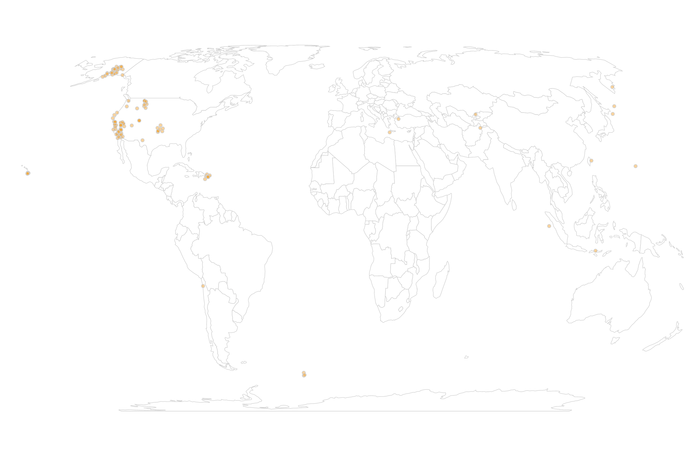
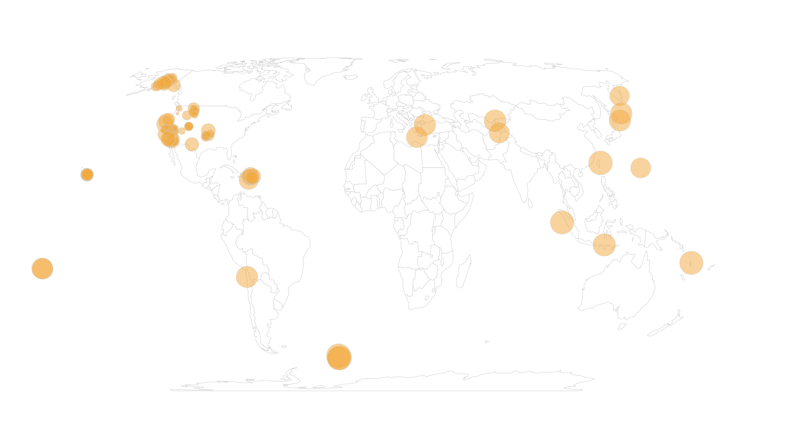
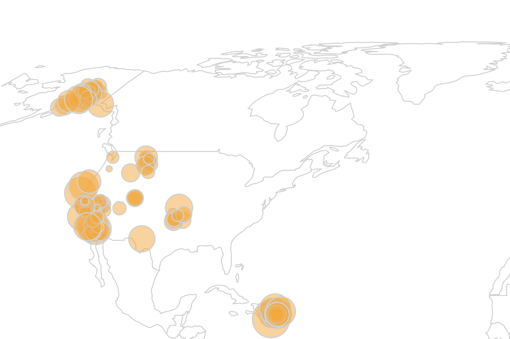

# BUBBLE MAP CHALLENGE

## 1. Draw a bubble for every earthquake

Our `Promises` contain two data objects. We have already drawn the base map by passing in our `geo.features` to the `geoPathGenerator`. Now, let's use the same projection specified earlier in the code to place a dot on each earthquake location. Inspect the `data` object passed into your `drawMap` function. For each earthquake, there is a `longitude` and `latitude` field. We want to pass these attributes into our `projection` function. Remember from the slides: projection functions accept an array containing two values. The output of the function is also two values. For bubbles, we need a `cx` and `cy`...

Make each bubble orange with a light gray stroke outline.

## 2. Size the bubbles by magnitude

Once you have plotted the earthquakes, set the size of each bubble so that it represents the magnitude of each earthquake. Change the opacity of the bubbles so that they are slightly translucent, allowing you to see where bubbles overlap in clusters.

## 3. Allow users to zoom and pan

Our map is looking better, but it's hard to see some of the circles still. Let's allow the user to zoom and pan. This will look a bit different from the `drag()` code in the choropleth challenge, since we are not using an Orthographic projection anymore. We will take a new approach this time: handle all interactions with a `transform`.

In the code you will find the start of a zoom call: `d3.zoom().scaleExtent([1, 8])`. This line of code creates a zoom listener function and sets the min and max of how far the user can zoom. Now we need to add onto this an `on('zoom', function(event) {...})` to specify what to do when the user zooms. Start by consoling out the `event` parameter inside the curly brackets to see it's values. 

Since we have stored all our SVG elements in the `g` variable, we should be able to move everything by selecting this variable. To keep everything in scale, you will need to add a `transform` attribute that does two things: 1) moves the map left/right or up/down depending on user drag and 2) scales the objects larger or smaller depending on the zoom level. For a reminder on types of `transform` see this article: https://developer.mozilla.org/en-US/docs/Web/SVG/Tutorial/Basic_Transformations.

## 4. Add a tooltip

Let's add a tooltip that tells the user the `place` and the `mag` for each earthquake.

*Hint: the tooltip might flicker for you...if it does, remember there are more options than just `mouseover` and `mouseout`!*

## 5. Add a legend

Some sense of size might be useful for users if they don't want to hover. Try adding a legend of "nested" circles in the top left of the chart. There are multiple ways to accomplish this...do whatever works for you. Just try to match the screenshot best you can!

## BONUS!

Our zooming works well, but in California it is hard to see where the earthquakes are happening...there is a lot of overlap among the circles. This one is tricky! If you have any ideas, see if you can make it happen in the code. We will go over the solution together!