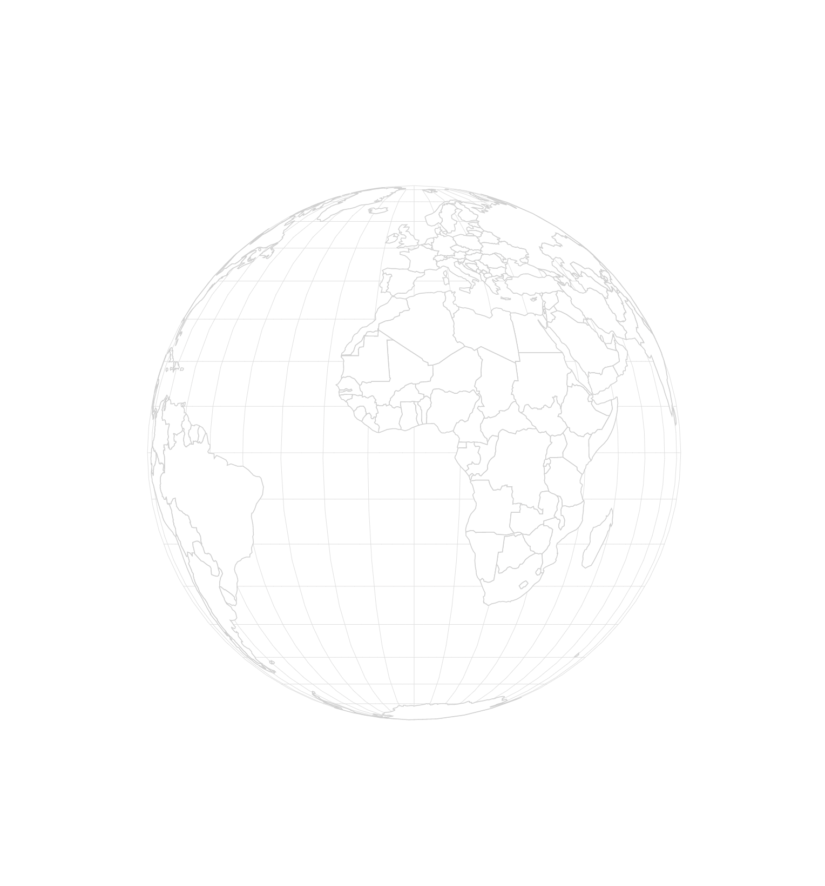

# CHOROPLETH CHALLENGE

## 1. Shade each country by population

When working with global data, it's common to find "mis-matches" in the data. Sometimes a country will not have data at all. Other times the country abbreviation or acronym is spelled differently in the GeoJSON compared to the CSV file. You can analyze the data locally before coding, or you can add in some "fail-safes" to your code to find out where you are missing information.

We will be shading the `fill` attribute of each country by doing a `find` lookup on our `data` object. It will look like this:

`data.find(el => el.code == d.id)`

Here our `data` is our CSV file data. A `find` lookup will loop through each of the records in `data` and grab the `code` for each record. A `find` is successful if our `el.code` matches the `d.id` (which is taken from our `geo.features` file).

The result of a `find` lookup is a single object in return. Place this code inside of a function for your `fill` attr. Then, store the resulting object in a variable. Finally, use a data variable from that object to assign a linear color scale to the `fill` attribute of each country.

*Hint: you might run into some `undefined` errors. Adding in some if/else logic should help you get around these! But also consider, how could you find out which country names are "missing" from the CSV data? How should you color these countries if they are missing?*

## 2. Add a zoom function

Using the `drag` code as a template, add a `zoom` function to listen for user scrolling. In this case, we care most about the parameter `k` inside our `event` callback, which is sort of like our current "zoom level". Once you have pulled this value out of `event`, you'll need to do two things:
- update the value inside `projection.scale(value)` (hint: multiplication works better here than addition!)
- re-call our path generator on all of our `path` elements using a `selectAll('path')`

